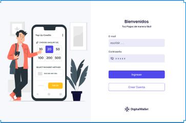
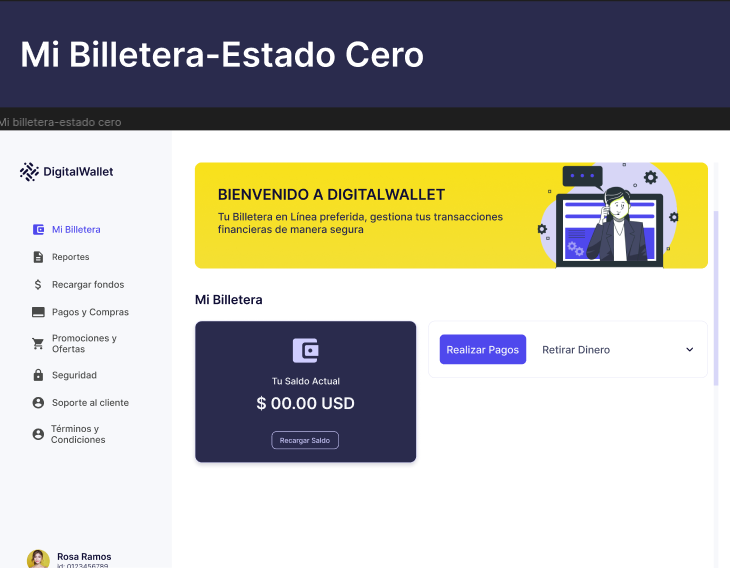
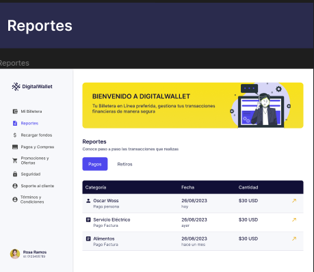

## Digital wallet

- go to deployment: https://c13-30-t-python.vercel.app/login

This project seeks to implement a virtual wallet with actions such as

- payments
- withdrawal
- transfer

Online platform to make payments, receive money and keep a record of the financial movements of registered customers.
The main objective is to facilitate users in the management and use of their electronic funds in a convenient and secure way as long as they are registered, to be able to recharge their funds, withdraw money, view their balance, manage their transactions, view the transaction history, and display alerts of any of their movements.

APIS:
For more information about apis.

dependencies:

- Django==4.2.4
- djangorestframework==3.14.0
- psycopg2==2.9.7

Authors:

